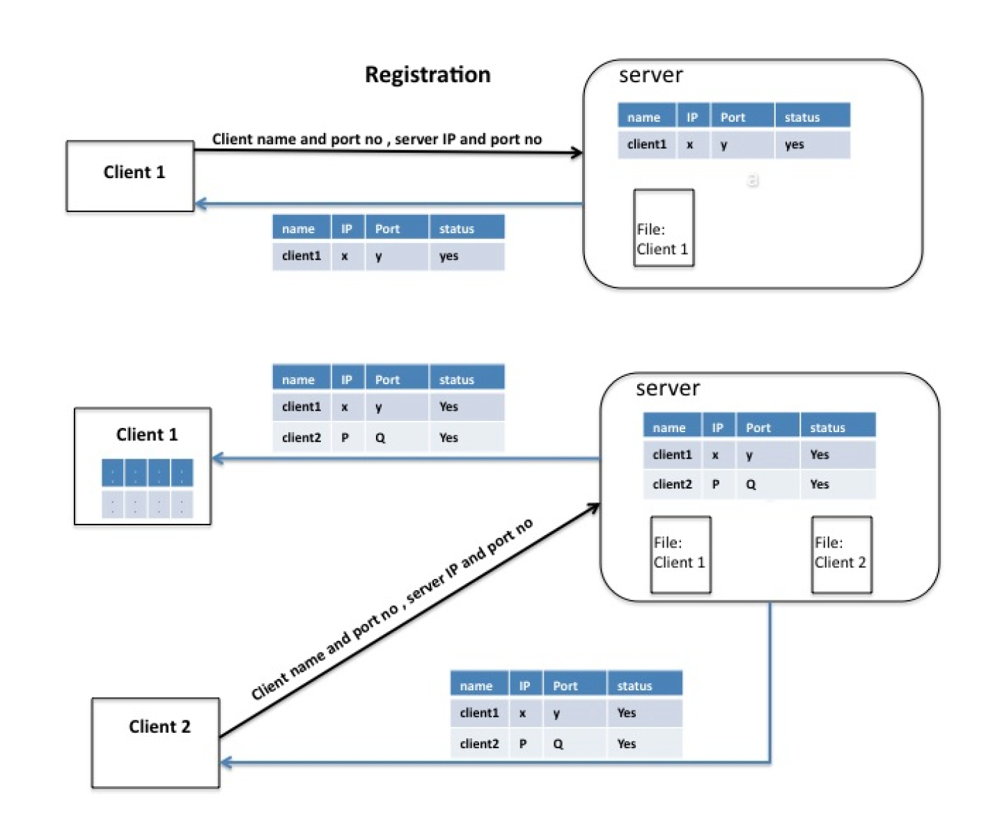
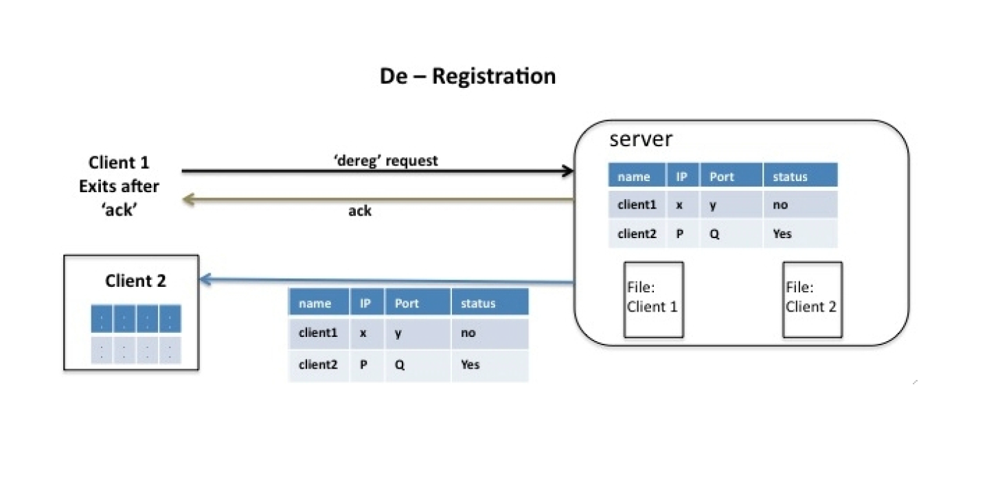
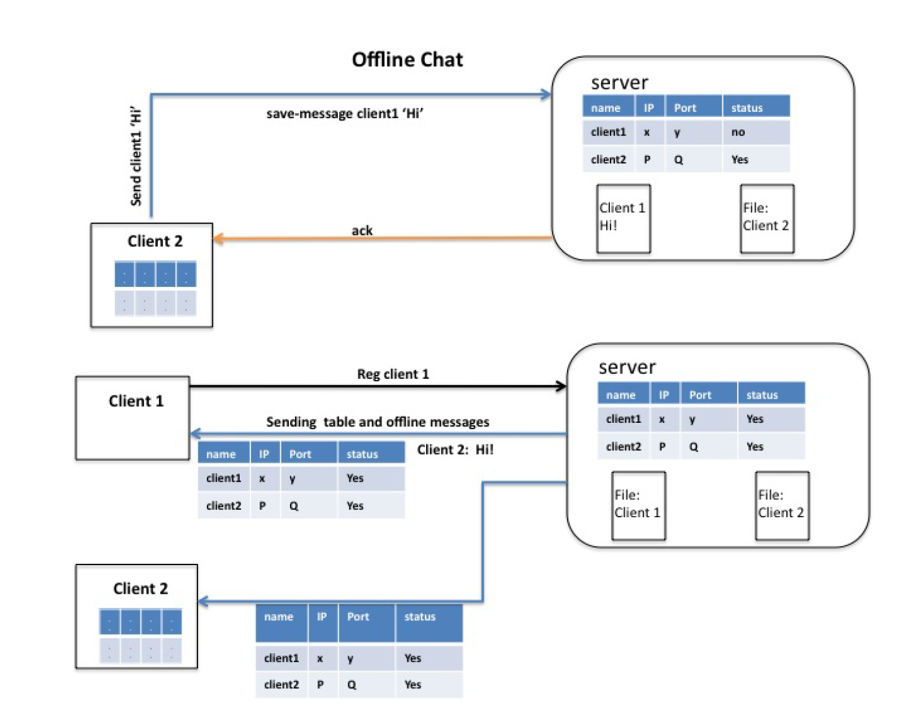

#### Compile and run ####
I used python so compiling and running is extremely easy.
To bring up the server, use the command line arguments:
```
$ python UdpChat -s <port number>
```
Similarly, to bring up the client, use the command line arguments:
```
$ python UdpChat -c <nick-name> 127.0.0.1 <server Port> <client Port>
```
### How it works




#### Tests ####
Some test have been logged in the test.txt file. Includes how the client 
window would look like. The server prints various messages to help in the
debug of the program. Please ignore server output. It is not logged in the
test cases, but will appear when the server mode is run.

#### Extras ####
If a client registers, exits the program using Ctrl+C, and registers back in,
the server will deliver any saved messages to this client.

#### Known bugs ####
If a client registers, exits the program using Ctrl+C, and registers back in,
the server will not let it register unless another client tried sending that
client a message. If not, the server would have never pinged the client and 
would still have in the server's table that the client trying to register is
in fact online.

There is a bit of a delay between peer to peer messages, but ACKs are still very
gracefully handled. 

I handled all cases where my server crashed and when the client crashed as well,
but of course there may be more bugs I don't know of because of how I tested
my program.

I couldn't test the "Client exists" scenario, because I just don't know how I
can test this case. Regardless, the implementation to handle this case is there.

I did not handle the case where two servers are running. 

#### How the server works ####
The server uses the address 127.0.0.1 and whatever port. The case where an
invalid port number is used is handled: program will print error msg and will
exit. 

Now the server is ready to receive any incoming messages. It will act on reg,
dereg, and send. If it receives an unknown command (which probably wouldn't
because of the extensive quality check I did on the client side to check for
commands that the server can't handle), it will not act on it. After recev
any of the accepted commands, it will handle the command and it will send the
updated table to all of the online clients. I used a dictionary to store the
clients. The key is the client name and the value is a list that holds the
IP, socket number, and status of the client. I also use a dictionary to store
the messages for offline clients. In this case, the key is the the recipient
and the value is a list that stores lists. This nested list stores the sender,
the timestamp, and the message. Key value pairs are deleted once messages are
sent to recipient. 

#### How the client works ####

After the arguments are validated, the shell prompt comes up. A client that has
never registered with the server still uses the same command to register. The
client will not automatically register when using the correct command line args.
To register or log back in, use the following command:
```
>>> reg <nick-name>
```
If all goes well, the client will one of six things:
1. A welcome message
2. A welcome back message
3. A welcome message along with a client table updated message.
4. An error message that the nickname is already being used and online
5. A welcome back message with a client table updated message
6. A welcome back message along with saved messages and client table

I set up the client table update so that it would show the table on the screen.
The client also verifies that the nick-name used to register is the same as the
command line argument given. As well as on the server, I used a dictionary to
store the client table. I do not send packages over the socket, I only send
strings. So basically, a client received a number of clients it will be recvng,
and then listens for that many times. It listens for the name, the IP, the
socket, and the status, and then stores it in the local table.

The client is constantly alternating between listening the raw_input() and the
socket for incoming messages. It doesn't use threads (I am very unfamiliar with
the subject). This does produce a bug though. The only thing that has happened
to me regarding this implementation is that the ACKs timeout for peer to peer
messaging so I put the timeout to be longer. Also, say you are writing something
and a client in your table deregisters, the server will send you the table and
will cut your typing, but nevertheless you can keep writing and all of your 
input will be handled. So you experience see something like:
```
>>> dere(Client table updated.) -- {table}
>>> g x
```
Deregistration for x will be successful, but that will happen. This is only the
case where the table updates while client is writing command.

ACKs and timeouts vary though the program. This was needed because some ACKs were
being sent late, but still being sent and thus produced erroneous behavior in the
architecture. For my implementation, I put a 2 second timeout for the peer-to-peer
message received ACK because I was having this bug where the send would timeout, the
sender would send the save-message request to the server, the server would send the
sender that the client exists, the sender would send the message again, and recv
ACK or would timeout again. The recipient in this case would receive various times
the same message. To avoid this, I set the timeout to be longer so that the recp
would still have some time to send the ACK because the client might be listening
to input at that time when the message is sent. 

#### Features ####
This program allows you to send messages to other clients across UDP sockets. 
Server handles registration, deregistration, and offline chat. Server is also
responsible for distributing client table to all other clients, new ones and
old ones as long as they are online.
